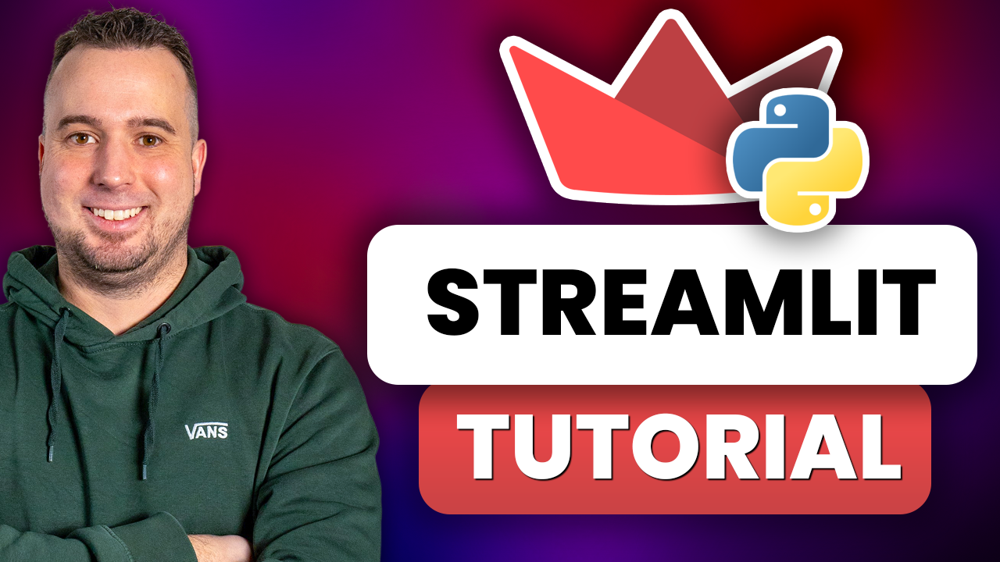

<h1>Streamlit Tutorial</h1>

<h2>Watch the full tutorial on my YouTube Channel</h2>
<div>

<a href="https://youtu.be/gYaxPHK9XL4">
    
</a>
</div>

<h2>Prerequisites</h2>
<ul>
  <li>Python 3.11+</li>
</ul>

<h2>Installation</h2>
<h3>1. Clone the repository:</h3>

```
git clone https://github.com/ThomasJanssen-tech/Streamlit-Tutorial.git
cd Streamlit-Tutorial
```

<h3>2. Create a virtual environment</h3>

```
python -m venv venv
```

<h3>3. Activate the virtual environment</h3>

```
venv\Scripts\Activate
(or on Mac): source venv/bin/activate
```

<h3>4. Install libraries</h3>

```
pip install -r requirements.txt
```

<h3>5. Add OpenAI API Key</h3>
Rename the .env.example file to .env
Select whether you want to use Ollama, OpenAI or Anthropic
If OpenAI/Anthropic: add your API key

<h2>Executing the scripts</h2>

- Open a terminal in VS Code

- Execute the following command:

```
streamlit run 1_translator.py
streamlit run 2_file_qa.py
streamlit run 3_chatbot.py
```
